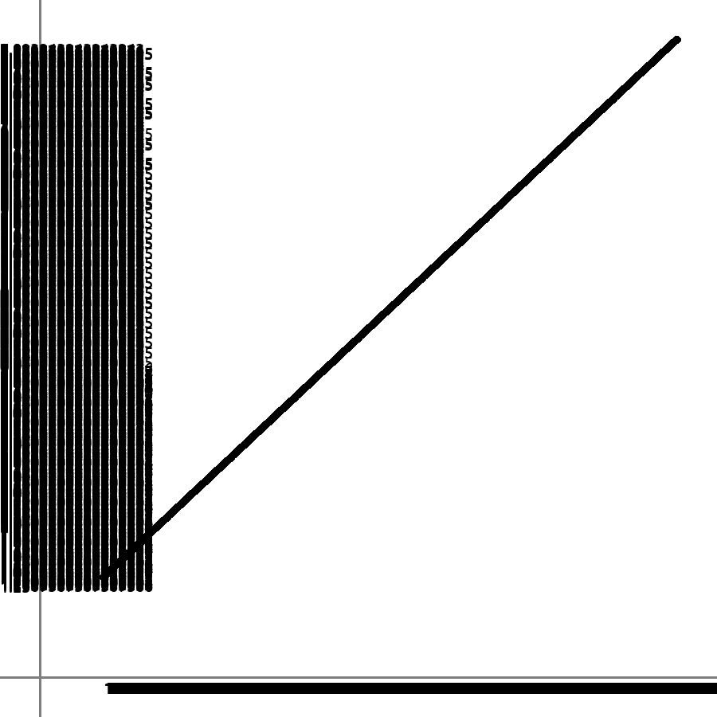

# OHIOgrapher
### the jankiest graph maker tool for python

**_to install OHIOgrapher just do:_**
```cmd
pip install git+https://github.com/andregp222/OHIOGrapher.git@APLHA-PLS-DO-NOT-USE
```

**_to use OHIOgrapher just:_**
```python
import OHIOgrapher.Grapher as og

data = [(x1,y1),(x2,y2),(x3,y3),(x4,y4)]#data goes here
og.DrawGraph(data)

```

### CAUTION:
there is no maximum amount of values that you can put in the graph, but it can become kinda of a clisterf*ck to read

Example:


, but fortunately you can prevent this by making the width and height bigger, just please dont go bananas on it.


# HAVE FUN!!!
#### you absolute twat
